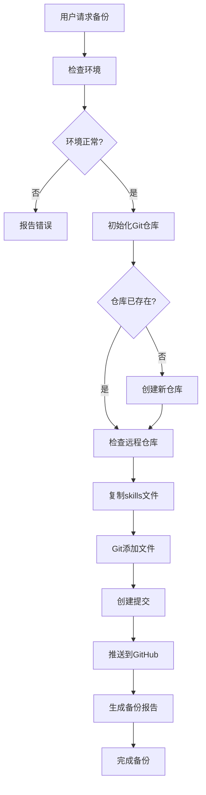

# 备份工作流程

## 概述

本文档描述 OpenCode skills 备份的完整工作流程，包括触发条件、执行步骤和恢复流程。

## 1. 触发条件

### 1.1 用户请求
当用户使用以下关键词请求时触发备份：
- "备份 skills"
- "备份我的技能"
- "上传 skills 到 GitHub"
- "skills 备份状态"
- "检查 skills 备份"

### 1.2 自动触发
可配置的自动触发条件：
- 每日定时备份
- Skills 目录有重大变更时
- 每周完整备份

### 1.3 手动触发
通过命令行手动触发：
```bash
cd /Users/wsxwj/.config/opencode/skills/backup-skills
python3 scripts/backup_skills.py
```

## 2. 备份流程

### 2.1 流程图


### 2.2 详细步骤

#### 步骤 1: 环境检查
```python
# 检查项目
1. Skills 目录是否存在
2. Git 是否安装
3. 网络连接是否正常
4. GitHub 访问权限
```

#### 步骤 2: 仓库初始化
```python
# 初始化流程
1. 检查备份目录
2. 初始化 Git 仓库（如果需要）
3. 设置 .gitignore
4. 创建 README.md
5. 配置远程仓库
```

#### 步骤 3: 文件备份
```python
# 文件操作
1. 扫描 skills 目录
2. 排除备份目录自身
3. 复制文件到备份目录
4. 计算文件哈希值
5. 记录变更信息
```

#### 步骤 4: Git 操作
```python
# Git 流程
1. git add . （添加所有文件）
2. git status （检查变更）
3. git commit （创建提交）
4. git push （推送到远程）
```

#### 步骤 5: 报告生成
```python
# 生成报告
1. 备份时间戳
2. 文件统计信息
3. 变更详情
4. 提交信息
5. 下次备份建议
```

## 3. 备份策略

### 3.1 增量备份
- 只备份有变化的文件
- 基于文件哈希值检测变更
- 减少备份时间和存储空间

### 3.2 完整备份
- 每周执行一次完整备份
- 清理旧备份文件
- 验证备份完整性

### 3.3 版本控制
- 每次备份创建新的提交
- 保留历史版本
- 支持版本回滚

## 4. 恢复流程

### 4.1 从备份恢复
```bash
# 恢复单个技能
python3 scripts/skill_utils.py --restore <skill-name>

# 恢复所有技能
python3 scripts/backup_skills.py --restore-all
```

### 4.2 恢复步骤
1. **选择恢复点**：查看备份历史
2. **验证备份**：检查备份完整性
3. **执行恢复**：复制文件到目标目录
4. **验证恢复**：检查恢复的文件

### 4.3 恢复验证
```python
# 验证恢复的文件
1. 文件数量匹配
2. 文件内容一致
3. 目录结构完整
4. 权限设置正确
```

## 5. 监控和日志

### 5.1 日志记录
```python
# 日志级别
- DEBUG: 详细调试信息
- INFO: 正常操作信息
- WARNING: 警告信息
- ERROR: 错误信息
- CRITICAL: 严重错误
```

### 5.2 监控指标
```python
# 监控项目
1. 备份成功率
2. 备份耗时
3. 文件数量变化
4. 存储空间使用
5. 网络传输速度
```

### 5.3 报警机制
```python
# 触发报警的条件
1. 备份失败
2. 备份超时（> 10分钟）
3. 文件丢失
4. 存储空间不足
5. 网络连接失败
```

## 6. 优化策略

### 6.1 性能优化
```python
# 优化措施
1. 并行文件复制
2. 增量哈希计算
3. 压缩备份文件
4. 缓存目录结构
```

### 6.2 存储优化
```python
# 存储策略
1. 清理旧备份（保留最近30天）
2. 压缩历史版本
3. 使用 Git LFS 处理大文件
4. 定期清理临时文件
```

### 6.3 网络优化
```python
# 网络优化
1. 断点续传
2. 压缩传输
3. 多线程上传
4. 智能重试机制
```

## 7. 错误处理

### 7.1 常见错误
```python
# 错误类型和解决方案
1. 文件权限错误 → 检查权限设置
2. 网络连接错误 → 重试机制
3. 存储空间不足 → 清理旧备份
4. Git 冲突 → 合并或重置
5. 认证失败 → 更新凭证
```

### 7.2 重试策略
```python
# 重试机制
1. 首次失败：等待 5 秒重试
2. 第二次失败：等待 30 秒重试
3. 第三次失败：报告错误并停止
```

### 7.3 回滚机制
```python
# 备份失败回滚
1. 保留上次成功备份
2. 清理失败的文件
3. 恢复目录状态
4. 记录失败原因
```

## 8. 维护任务

### 8.1 日常维护
```bash
# 每日任务
1. 检查备份状态
2. 清理临时文件
3. 验证备份完整性
4. 更新备份日志
```

### 8.2 每周维护
```bash
# 每周任务
1. 执行完整备份
2. 清理旧备份版本
3. 优化存储空间
4. 生成周度报告
```

### 8.3 月度维护
```bash
# 每月任务
1. 审查备份策略
2. 更新备份脚本
3. 测试恢复流程
4. 优化性能配置
```

## 9. 扩展功能

### 9.1 多仓库备份
```python
# 支持多个备份目标
1. GitHub 主仓库
2. GitLab 镜像仓库
3. 本地 NAS 备份
4. 云存储备份
```

### 9.2 加密备份
```python
# 加密选项
1. GPG 加密敏感文件
2. 密码保护备份
3. 加密传输通道
4. 安全存储密钥
```

### 9.3 自动化调度
```python
# 调度功能
1. Cron 定时任务
2. 系统服务
3. 监控触发
4. 手动覆盖
```

## 10. 最佳实践

### 10.1 备份策略
- 3-2-1 规则：3份备份，2种介质，1份离线
- 定期测试恢复流程
- 监控备份状态
- 文档化备份流程

### 10.2 安全实践
- 保护备份凭证
- 加密敏感数据
- 限制备份访问
- 定期审计备份

### 10.3 性能实践
- 增量备份减少负载
- 压缩备份文件
- 并行处理大文件
- 缓存目录信息

## 11. 故障排除指南

### 11.1 快速诊断
```bash
# 诊断命令
./scripts/backup_skills.py --status      # 检查状态
./scripts/backup_skills.py --test        # 测试备份
./scripts/backup_skills.py --debug       # 调试模式
```

### 11.2 常见问题
- **备份速度慢**：检查网络和磁盘性能
- **认证失败**：更新 GitHub 令牌
- **存储空间不足**：清理旧备份
- **文件冲突**：解决 Git 冲突

### 11.3 联系支持
如果问题无法解决：
1. 查看详细日志
2. 收集错误信息
3. 联系系统管理员
4. 提交问题报告