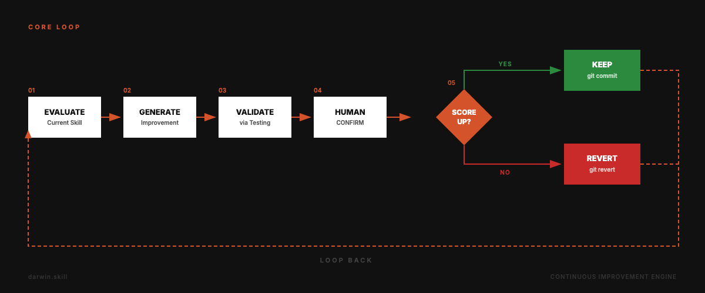
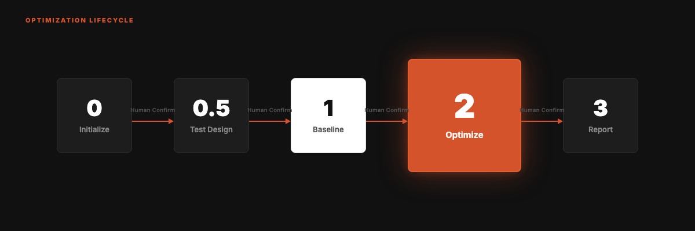

<div align="right">

English | **[中文](README.md)**

</div>


<div align="center">

# darwin.skill 2.0

**Optimize your Agent Skills the way you train models.**

Inspired by [Karpathy's autoresearch](https://github.com/karpathy/autoresearch). Autonomous experiment loops, applied to skill optimization. A ratchet that only turns forward.

**v2.0** · Updated 2026-05-28 · A structural upgrade integrating Microsoft Research's [SkillLens](https://arxiv.org/abs/2605.23899) and [SkillOpt](https://arxiv.org/abs/2605.23904) papers.

[](LICENSE)
[](#whats-new-in-20)
[](https://skills.sh)
[](https://skills.sh)
[](https://github.com/microsoft/SkillOpt)

```
npx skills add alchaincyf/darwin-skill
```

</div>

---

> [!NOTE]
> **🤝 Microsoft Research lists darwin-skill as an official SkillOpt integration.**
> On 2026-06-03, the [SkillOpt repo](https://github.com/microsoft/SkillOpt) noted:
> *"gbrain, gbrain-evals, and **darwin-skill** have all integrated SkillOpt."*
> We absorbed its validation-gated framework; it added darwin to its integration list. A two-way nod. 👉 [Visit the SkillOpt repo](https://github.com/microsoft/SkillOpt)

---

## What's New in 2.0

v2.0 is not a patch release. It's a structural upgrade absorbing two Microsoft Research papers published on 2026-05-22. Five concrete changes:

**1. Rubric expanded from 8 → 9 dimensions** (integrating [SkillLens](https://arxiv.org/abs/2605.23899)'s empirically validated 73.8% rubric recipe)

- The legacy "error handling" dimension is upgraded to **Failure Mechanism Encoding**: not just "tell the agent to be careful," but explicitly encode known failure paths into the skill.
- The legacy "clarity" dimension is upgraded to **Actionable Specificity**: explicitly bans vague hedge words like "suggest / could consider / depending on / use judgment / case by case."
- A new ninth dimension **High-Risk Action Blacklist**: destructive operations like `rm` / `git reset --hard` / `force push` must be explicitly listed as forbidden in the skill.

**2. Validation aligned with SkillOpt's validation-gated design**

- Multi-judge independent review: 2 independent judges per round
- Judges never reused: each new round spawns fresh judges to avoid anchoring bias
- Early stopping: if a round's score gain < 1 point, automatically halt to prevent padding for score
- Dry-run control: warn when dry-run ratio exceeds 30%

**3. Human-in-the-loop at three checkpoints** (the core differentiator from SkillOpt's fully autonomous design)

- Phase 1 baseline eval: auto + human review the report, decide what to optimize
- Phase 2 single-dimension edit: 🔴 CHECKPOINT mandatory pause for user confirmation
- Phase 2.5 test-prompt run (optional)
- Phase 3 regression test: 🛑 STOP if gain falls below threshold

**4. Anti-pattern blacklist with 8 explicit forbidden behaviors**

1. Same AI both edits and scores (SkillLens empirical: LLM self-eval accuracy only 46.4%)
2. Using `git reset --hard` as a rollback mechanism (use `git revert`)
3. Padding edits just to push the score up
4. Skipping test prompts and scoring directly
5. Changing multiple dimensions in one round
6. Dry-run ratio > 30%
7. Silently swallowing exceptions
8. Ignoring correlated dimension clusters

**5. Empirical validation data**

- huashu-gpt-image skill: **80.8 → 91.5 → 91.65** (+10.85, consensus across 6 independent judges)
- darwin-skill self-eval: **86.05 → 92.05 → 92.7**

---

## The Core Loop



Evaluate → Improve → Test → Human Confirm → Keep or Revert. Repeat.

---

## Why This Exists

Agent skill ecosystems are expanding fast. Claude Code, Codex, OpenClaw, Trae, CodeBuddy and more all support the SKILL.md format. When you have 10 skills, you can maintain them by hand. When you have 60+, you need a system.

Traditional skill review is purely structural: does the frontmatter look right? Are the steps numbered? Do the file paths exist? But a perfectly formatted skill can still produce terrible output.

darwin.skill evaluates both **structure** and **real-world effectiveness**, then keeps only the changes that actually improve things.

---

## From autoresearch to Skill Optimization

This project maps Karpathy's autoresearch directly onto skill optimization:

| autoresearch | darwin.skill | Why |
|:---|:---|:---|
| `program.md` | This SKILL.md | Defines evaluation criteria and constraints |
| `train.py` | Each target SKILL.md | The single editable asset per experiment |
| `val_bpb` | 9-dimension weighted score (max 100) | Quantifiable optimization target |
| `git ratchet` | keep / revert mechanism | Only improving commits survive |
| `test set` | test-prompts.json | Validates whether improvements are real |
| Fully autonomous | **Human in the loop** | Skill quality is more subjective than loss |

The key difference: autoresearch is fully autonomous (loss is just a number). Skill quality sometimes needs human judgment. So darwin.skill pauses after each skill's optimization cycle, shows you the diff and score delta, and waits for your confirmation.

---

## Five Core Principles

| # | Principle | Details |
|:---|:---|:---|
| 01 | **Single editable asset** | One SKILL.md per experiment. One change, one measurement, one decision |
| 02 | **Dual evaluation** | Structure scoring (static analysis) + effectiveness scoring (live test execution) |
| 03 | **Ratchet mechanism** | Score can only go up. Regressions are auto-reverted |
| 04 | **Independent scoring** | The agent that edits is never the agent that scores (SkillLens: LLM self-eval is only 46.4% accurate) |
| 05 | **Human in the loop** | System pauses after each skill. You review, then continue |

---

## 9-Dimension Evaluation Rubric

Total: 100 points. Structure + Effectiveness. v2.0's three new dimensions come directly from SkillLens's empirically validated rubric.


The three new dimensions (SkillLens 73.8% rubric recipe):

| Dimension | Description |
|:---|:---|
| **Failure Mechanism Encoding** | Explicitly encode known failure paths, not just "be careful" reminders |
| **Actionable Specificity** | Ban vague hedge words like "suggest / could consider / depending on / use judgment / case by case" |
| **High-Risk Action Blacklist** | Destructive operations (rm / git reset --hard / force push) must be explicitly forbidden |

> Live test performance has the highest weight. A beautifully written skill that produces bad output is still a bad skill.

---

## The Optimization Cycle

Five phases. The system runs autonomously within each phase but pauses between phases for human confirmation.



**Phase 2 (the heart, hardened in v2.0):**

1. Find the lowest-scoring dimension
2. Generate one targeted improvement (one dimension per round, blacklist #5)
3. Edit SKILL.md, git commit
4. **Spawn 2 independent sub-agents** to re-score (next round spawns fresh judges to avoid anchoring)
5. Score up → keep. Score down → `git revert` (never `git reset --hard`, blacklist #2)
6. Round gain < 1 point → early-stop automatically (no padding for score)
7. 🔴 CHECKPOINT pauses, shows diff + score delta, waits for human confirmation

---

## The Ratchet

Scores can only go up. Failed experiments are cleanly reverted. No regressions accumulate over time.


Round 2 scored 75, below the current best of 78. Auto-reverted. Effective baseline stays at 78. Subsequent improvements build from 78, not 75.

---

## Quick Start

```bash
npx skills add alchaincyf/darwin-skill
```

After installation, tell your agent: "optimize all skills" or "optimize [skill-name]". Works with any tool that supports the SKILL.md format.

Can't access GitHub? Download the zip: [darwin-skill.zip](https://pub-161ae4b5ed0644c4a43b5c6412287e03.r2.dev/skills/darwin-skill.zip). Extract and place SKILL.md in `~/.claude/skills/darwin-skill/`.

---

## Design Inspiration

Directly inspired by **Andrej Karpathy's [autoresearch](https://github.com/karpathy/autoresearch)**.

The core mechanism is identical: **keep only measurable improvements, revert everything else.**

v2.0 builds on this foundation by integrating two Microsoft Research papers (published 2026-05-22): [SkillLens](https://arxiv.org/abs/2605.23899) provides the empirically validated rubric design, and [SkillOpt](https://arxiv.org/abs/2605.23904) provides the formal framework of validation-gated edits.

---

## References & Credits

v2.0's design directly builds on the following academic work. Recommended reading for researchers and engineers working on the skill ecosystem:

### SkillLens

> Microsoft Research. *From Raw Experience to Skill Consumption: A Systematic Study of Model-Generated Agent Skills.* arXiv:2605.23899, 2026.

- Paper: https://arxiv.org/abs/2605.23899
- **Contribution**: The empirically validated 73.8% rubric recipe. darwin.skill v2.0's three new dimensions (Failure Mechanism Encoding / Actionable Specificity / High-Risk Action Blacklist) come directly from this paper. It is also the empirical source for the "same AI edits and scores" anti-pattern — LLM self-eval accuracy is only 46.4%.

### SkillOpt

> Microsoft Research. *SkillOpt: Executive Strategy for Self-Evolving Agent Skills.* arXiv:2605.23904, 2026.

- 🔗 **Code repo**: [github.com/microsoft/SkillOpt](https://github.com/microsoft/SkillOpt) (`pip install skillopt`, v0.1.0 on PyPI)
- Project page: https://microsoft.github.io/SkillOpt/
- Paper: https://arxiv.org/abs/2605.23904
- **Contribution**: The formal framework of validation-gated edits. Treats a skill as the "external trainable state" of a frozen model: every edit must pass independent validation to be kept. darwin.skill v2.0's multi-judge independent review, non-reuse of judges, early stopping, and dry-run ratio control all align with this framework.
- 🤝 **Mutual recognition**: On 2026-06-03, the official SkillOpt repo listed darwin-skill as an integration: *"gbrain, gbrain-evals, and darwin-skill have all integrated SkillOpt."* They give us the framework; we give it real-world validation.

### autoresearch

> Andrej Karpathy. *autoresearch.* GitHub repository, 2026.

- Code: https://github.com/karpathy/autoresearch
- **Contribution**: The original inspiration for darwin.skill 1.0. The mapping of core mechanisms (program.md / train.py / val_bpb / git ratchet / test set) is inherited directly from autoresearch.

**The key difference between darwin and SkillOpt**: SkillOpt is fully autonomous; darwin.skill emphasizes human-in-the-loop — skill quality is more subjective than validation loss. Critical phases (baseline eval, single-dimension edit, regression test) mandatorily pause for the human to make the final judgment.

---

## About the Author

| | |
|:---|:---|
| 🌐 Website | [bookai.top](https://bookai.top) · [huasheng.ai](https://www.huasheng.ai) |
| 𝕏 Twitter | [@AlchainHust](https://x.com/AlchainHust) |
| 📺 Bilibili | [花叔](https://space.bilibili.com/14097567) |
| ▶️ YouTube | [@Alchain](https://www.youtube.com/@Alchain) |
| 📕 Xiaohongshu | [花叔](https://www.xiaohongshu.com/user/profile/5abc6f17e8ac2b109179dfdf) |
| 💬 WeChat | Search "花叔" |

---

## License

MIT

---

<div align="center">

**[Nuwa](https://github.com/alchaincyf/nuwa-skill)** creates skills.<br>
**Darwin** makes them evolve.<br><br>
*Keep only improvements. Time is on your side.*

<br>

MIT License © [花叔 Huashu](https://github.com/alchaincyf)

</div>
